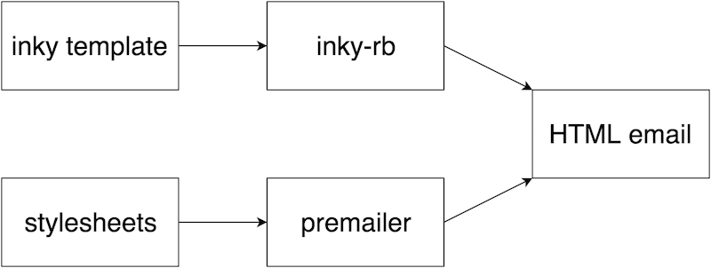

## How It Works



**inky-rb** is a pure Ruby implementation of the Inky templating language that converts simple custom HTML tags like `<row>` and `<column>` into the complex table-based HTML required for emails.

Using a CSS inliner like `premailer-rails` or `roadie`, you're able to keep your email templates lean by avoiding the need to manually embed styles in the markup. By parsing your email template, the inliner is able to locate your referenced stylesheet and go through all of the selectors specified within it, assigning the styles to matching elements within the document.

The result of this approach is an HTML email, as styled or as responsive as you need it, with a fraction of the code required by writing emails the old fashioned way.

---

## Getting Started

Installing inky-rb in your Rails application requires only a few simple steps. Get the ball rolling by adding the following to your app's Gemfile:

```ruby
gem 'inky-rb', require: 'inky'
# Stylesheet inlining for email
gem 'premailer-rails'
```

Then execute:

```bash
bundle install
```

Next, make sure that the stylesheet included in your email layout imports the Foundation for Emails styles:

```scss
@import "foundation-emails";
```

Rename your email templates to use the `.inky` file extension. Note that you'll still be able to use ERB within the `.inky` templates:

```
welcome.html      => welcome.html.inky
pw_reset.html.erb => pw_reset.html.inky
```

Finally, your mailer layout should have the following structure:

```html
<!DOCTYPE html PUBLIC "-//W3C//DTD XHTML 1.0 Strict//EN" "http://www.w3.org/TR/xhtml1/DTD/xhtml1-strict.dtd">
<html xmlns="http://www.w3.org/1999/xhtml">
<head>
  <meta http-equiv="Content-Type" content="text/html; charset=utf-8" />
  <!-- Enables media queries -->
  <meta name="viewport" content="width=device-width"/>
  <!-- Link to the email's CSS, which will be inlined into the email -->
  <link rel="stylesheet" href="assets/css/foundation-emails.css">
</head>

<body>
  <table class="body" data-made-with-foundation>
    <tr>
      <td class="center" align="center" valign="top">
        <center>
          <%= yield %>
        </center>
      </td>
    </tr>
  </table>
</body>
</html>
```

Done! You're now all set to start writing responsive emails in your Rails app.

---

## Standalone Assets

To include only the Foundation for Emails styles in your Asset Pipeline, without the Inky templating language, use the [**foundation_emails**](https://github.com/zurb/foundation-emails/#using-the-ruby-gem) gem.
